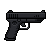

# "Sentinel-9" Service Pistol

> Transcribed from [`Deadlock Weapons and Items.docx`](../Deadlock%20Weapons%20and%20Items.docx),
> uploaded 2026-08-13. Category: Standard Firearm.
>
> **Naming, settled 2026-08-13:** the in-universe name stays as the primary name (matching the
> source document exactly) rather than being replaced by a bare real-world model name or a fully
> generic one — both were tried and reverted; see [`STORY_NOTES.md`](../STORY_NOTES.md) → "Weapon
> naming convention" for the full back-and-forth and the deciding reference point (Resident Evil's
> "Samurai Edge," an in-universe custom name for what's functionally a Beretta 92FS — the real-world
> gun is the *basis*, not the displayed name).
>
> **Real-World Basis:** functionally a 9mm service pistol, closest to a **Beretta M9**-style
> platform — consistent with "standard-issue sidearm used by the Ravenwood Police Department."
> Flavor/grounding detail only; caliber is recorded in the Stats table below, not the name.

*Real in-game sprite, uploaded by the project owner (2026-08-13).*

## Description

A standard-issue sidearm used by the Ravenwood Police Department. Known for its reliability and
balanced ergonomics, the Sentinel-9 gives survivors a dependable, quick-draw firearm suited for
early and mid-game engagements. Accurate at close to medium range, with just enough stopping power
to drop low-tier mutants if aimed well.

## Stats

| Stat | Value |
|---|---|
| Caliber | 9mm |
| Damage | 32 |
| Fire Rate | 0.28s |
| Bullet Speed | 28 |
| Handling | 0.35s |
| Mag Size | 15 |
| Scoped | false |
| Recoil | 3.0° |
| Noise lvl | 22 |
| Sight Range | +60 px |

## Story Placement

**Strong, unconfirmed match — flagged, not silently applied:** [`Locations/Ravenwood_Hotel.md`](../Locations/Ravenwood_Hotel.md)
and [`Characters/Dale_Pruitt.md`](../Characters/Dale_Pruitt.md) both already establish that Jim's
**first firearm** is "a handgun" taken from **Officer Dale Pruitt** — a Ravenwood PD officer —
after defeating his infected form inside the crashed cruiser (Chapter 1, Scene 41). The
Sentinel-9's own description ("standard-issue sidearm used by the Ravenwood Police Department") is
a near-perfect fit for an RPD officer's duty weapon. **This is very likely meant to be that same
handgun**, but no existing location/character/script file actually names the model — it's only ever
called "a handgun" or "the handgun." Treating this as the confirmed identity of Jim's first firearm
is a proposal pending explicit approval, not a locked fact; once approved, the generic "handgun"
references in `Ravenwood_Hotel.md`, `Characters/Dale_Pruitt.md`, and
`Scripts/Chapter_1_One_Night_Only.md` should be updated to name it specifically.

No other placement currently exists (e.g. as a separate pickup elsewhere).
