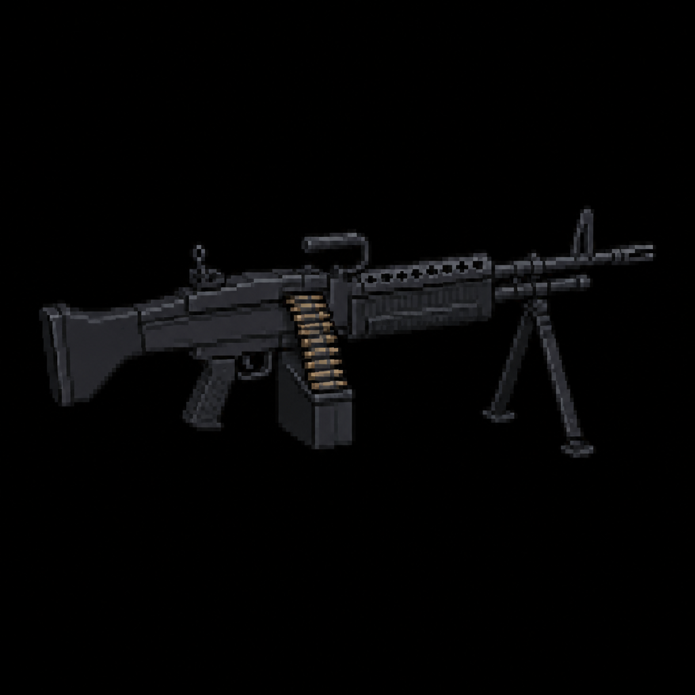

# "Steelstorm M60" Light Machine Gun

> Transcribed from [`Deadlock Weapons and Items.docx`](../Deadlock%20Weapons%20and%20Items.docx),
> uploaded 2026-08-13. Category: Standard Firearm.
>
> **Naming, settled 2026-08-13:** the in-universe name stays as the primary name — see
> [`Sentinel_9_Service_Pistol.md`](Sentinel_9_Service_Pistol.md) for the full naming rationale
> (the "Samurai Edge" precedent) and [`STORY_NOTES.md`](../STORY_NOTES.md) for the complete
> back-and-forth.
>
> **Real-World Basis:** functionally a belt-fed **M60** light machine gun (the "M60" in this
> weapon's own name is already a direct nod to that real gun) — consistent with "a belt-fed
> industrial machine gun salvaged from a Steelgate factory security cache." Flavor/grounding detail
> only.

*AI-generated inventory-icon concept (2026-08-13), style-anchored to the real uploaded weapon
sprites.*

## Description

A belt-fed industrial machine gun salvaged from a Steelgate factory security cache. Exceptional
sustained fire with massive recoil climb. Best for controlling chokepoints and mowing down hordes,
but extremely slow to ready.

## Stats

| Stat | Value |
|---|---|
| Damage | 24 |
| Fire Rate | 0.09s |
| Bullet Speed | 32 |
| Handling | 1.25s |
| Mag Size | 60 |
| Scoped | false |
| Recoil | 12.0° |
| Noise lvl | 45 |
| Sight Range | +65 px |

## Story Placement

**Plausible future placement, not locked:** the description's "Steelgate factory security cache"
lines up specifically with the Northwest/Industry district's planned secondary location, the
**Steelgate Loading Docks** (see [`MASTER_STORY.md`](../MASTER_STORY.md) → "Secondary Locations" —
the Refinery district's outline). No such scene is written yet — this is flagged as a strong,
name-matched candidate for whoever writes that district, not a decision made here.
