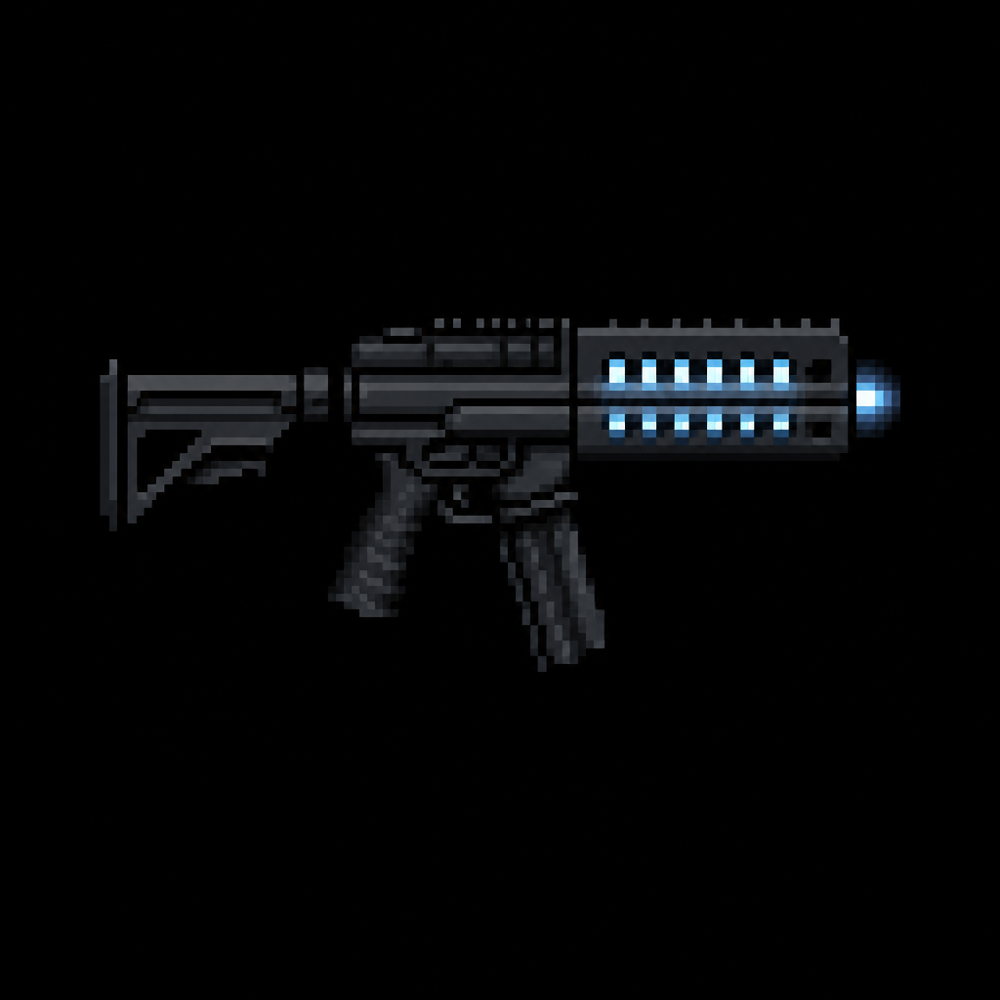

# "Thunderlance" Electromagnetic Railgun

> Transcribed from [`Deadlock Weapons and Items.docx`](../Deadlock%20Weapons%20and%20Items.docx),
> uploaded 2026-08-13. Category: Vanguard Experimental Prototype Set. See
> [`Weapons/README.md`](README.md) and [`STORY_NOTES.md`](../STORY_NOTES.md) for a note on this
> category's loose heading placement in the source document.
>
> **Naming:** kept as the in-universe document name — this is a fictional sci-fi prototype with no
> real-world firearm analog — see [`Sentinel_9_Service_Pistol.md`](Sentinel_9_Service_Pistol.md)
> and [`STORY_NOTES.md`](../STORY_NOTES.md) for the settled naming convention.

*AI-generated inventory-icon concept (2026-08-13), style-anchored to the real uploaded weapon
sprites.*

## Description

A Vanguard anti-bio-weapon prototype designed to penetrate armored Titans. Uses electromagnetic
rails to fire steel flechettes at extreme velocity. Long charge time, but deals catastrophic damage
with massive camera zoom.

## Stats

| Stat | Value |
|---|---|
| Damage | 150 |
| Fire Rate | 2.4s |
| Bullet Speed | 120 |
| Handling | 1.2s |
| Mag Size | 3 |
| Scoped | true |
| Recoil | 1.0° |
| Noise lvl | 50 |
| Sight Range | +220 px |

## Story Placement

Not yet placed in any scripted content. Its explicit purpose — "designed to penetrate armored
Titans" — introduces a not-yet-established enemy classification ("Titans") that doesn't appear
anywhere else in [`CANON.md`](../CANON.md), [`Creatures/`](../Creatures/README.md), or any current
script. Flagging this as a new term the source document introduces rather than quietly assuming
it refers to an existing creature (e.g. the [Zombie Conglomerate](../Creatures/Zombie_Conglomerate.md),
which is explicitly unkillable by any weapon including the shotgun, or a late-game boss). Its
Vanguard provenance and top-tier stats suggest very late-game placement (Chapter 3's underground
facility, per `CANON.md`'s outline), but nothing is locked here.
