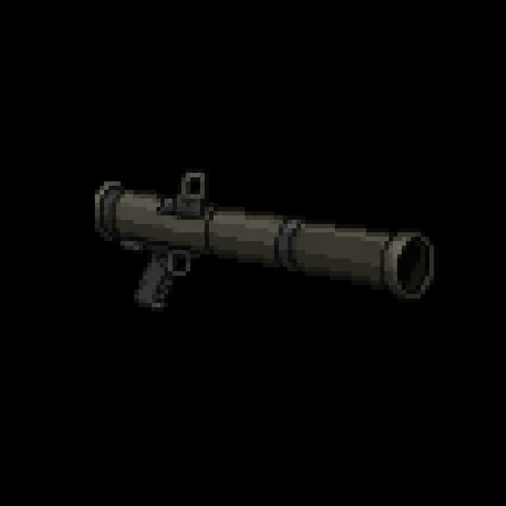

# "Titanbreaker RLR-7" Rocket Launcher

> Transcribed from [`Deadlock Weapons and Items.docx`](../Deadlock%20Weapons%20and%20Items.docx),
> uploaded 2026-08-13. Category: Heavy Weapon.
>
> **Naming:** kept as the in-universe document name — this is a fictional anti-bio-weapon launcher
> with no real-world firearm analog — see [`Sentinel_9_Service_Pistol.md`](Sentinel_9_Service_Pistol.md)
> and [`STORY_NOTES.md`](../STORY_NOTES.md) for the settled naming convention.

*AI-generated inventory-icon concept (2026-08-13), style-anchored to the real uploaded weapon
sprites.*

## Description

A single-shot, shoulder-fired anti-bio-weapon launcher reverse-engineered from Vanguard emergency
armaments. Designed to neutralize Behemoths, Ravener packs, and late-game boss entities. Heavy, slow
to ready, but absolutely devastating on impact.

## Stats

| Stat | Value |
|---|---|
| Damage | 220 (explosive AoE) |
| Fire Rate | 2.6s |
| Bullet Speed | 30 |
| Handling | 1.4s |
| Mag Size | 1 |
| Scoped | false |
| Recoil | 0° (rocket doesn't "spread," but firing locks you in place for 0.2s) |
| Noise lvl | 65 |
| Sight Range | +45 px |

### Special Effects

| Effect | Value |
|---|---|
| Explosion Radius | 120 px |
| Knockback | Medium (launches small mutants) |
| Self-damage | 50% if within blast radius |
| Environmental Interaction | Destroys wooden barricades / breakable walls |

## Story Placement

Not yet placed in any scripted content. Like the Thunderlance Railgun's "Titans," this weapon's
description introduces two more not-yet-established enemy classifications — "Behemoths" and
"Ravener packs" — that don't appear anywhere else in [`CANON.md`](../CANON.md) or
[`Creatures/`](../Creatures/README.md). Flagging both terms rather than assuming a match to any
existing creature (the closest tonal fit is the unkillable
[Zombie Conglomerate](../Creatures/Zombie_Conglomerate.md), but nothing confirms that). Its
"reverse-engineered from Vanguard emergency armaments" origin and "late-game boss entities" framing
suggest very late-game placement (Chapter 3 or a late district), consistent with the Thunderlance's
own placement note, but nothing is locked here. The barricade-destroying environmental interaction
is a mechanic not used anywhere in the currently-scripted content either.
