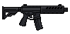

# "Vanguard M-15" AR Platform

> Transcribed from [`Deadlock Weapons and Items.docx`](../Deadlock%20Weapons%20and%20Items.docx),
> uploaded 2026-08-13. Category: Standard Firearm.
>
> **Naming, settled 2026-08-13:** the in-universe name stays as the primary name — see
> [`Sentinel_9_Service_Pistol.md`](Sentinel_9_Service_Pistol.md) for the full naming rationale
> (the "Samurai Edge" precedent) and [`STORY_NOTES.md`](../STORY_NOTES.md) for the complete
> back-and-forth.
>
> **Real-World Basis:** functionally a 5.56mm semi-automatic **AR-15**-platform rifle — consistent
> with "modified by Vanguard researchers for patrol and containment work." Flavor/grounding detail
> only; caliber is recorded in the Stats table below, not the name.

*Real in-game sprite, uploaded by the project owner (2026-08-13).*

## Description

A semi-automatic rifle modified by Vanguard researchers for patrol and containment work. The tuned
barrel and gas system provide better accuracy than civilian models, and the weapon's stability
makes it ideal for mid-range engagements. A favorite among survivors for its versatility and
consistent fire patterns.

## Stats

| Stat | Value |
|---|---|
| Caliber | 5.56mm |
| Damage | 27 |
| Fire Rate | 0.12s |
| Bullet Speed | 36 |
| Handling | 0.55s |
| Mag Size | 30 |
| Scoped | true |
| Recoil | 4.5° |
| Noise lvl | 32 |
| Sight Range | +120 px |

## Story Placement

Not yet placed in any scripted content. Its explicit **Vanguard** provenance ("modified by Vanguard
researchers for patrol and containment work") ties it to [`CANON.md`](../CANON.md)'s Vanguard
BioSystems/Project Ashen backstory — a natural fit for a district or scene with a direct Vanguard
presence (e.g. the underground facility in Chapter 3, per `CANON.md`'s outline-level notes), but no
such scene is written yet. Flagging as a strong candidate for whoever writes that content, not a
decision made here.
